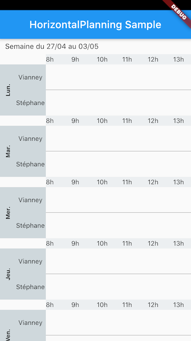

# Composant horizontal-planning (Flutter)

Composant permettant un affichage d'un planning horizontal, scrollable et adaptable à toutes les tailles.




# Exemple d'utilisation

```dart
import 'package:flutter/material.dart';
import 'package:scrollmulti/scroll-page.dart';

void main() {
  runApp(MyApp());
}

class MyApp extends StatelessWidget {
  // This widget is the root of your application.
  @override
  Widget build(BuildContext context) {
    return MaterialApp(
      theme: ThemeData(
        primarySwatch: Colors.blue,
        visualDensity: VisualDensity.adaptivePlatformDensity,
      ),
      home: SafeArea(
        top: true,
        child: Scaffold(
          appBar: AppBar(
            title: Text("HorizontalPlanning Sample"),
          ),
          body: HorizontalPlanning(
            title: "Semaine du 27/04 au 03/05",
            employees: [
              "Vianney",
              "Stéphane",
            ],
            nbHours: 24,
            startHour: 8,
            weekDays: ["Lun.", "Mar.", "Mer.", "Jeu.", "Ven.", "Sam.", "Dim."],
            hourStep: 2,
          ),
        ),
      ),
    );
  }
}
```


# TODO List

- Manage display with hour steps (ex. 2h 4h 6h 8h...), 
- Be able to customize hours labels
- Events management
- Be able to customize colors, styles and so on...
